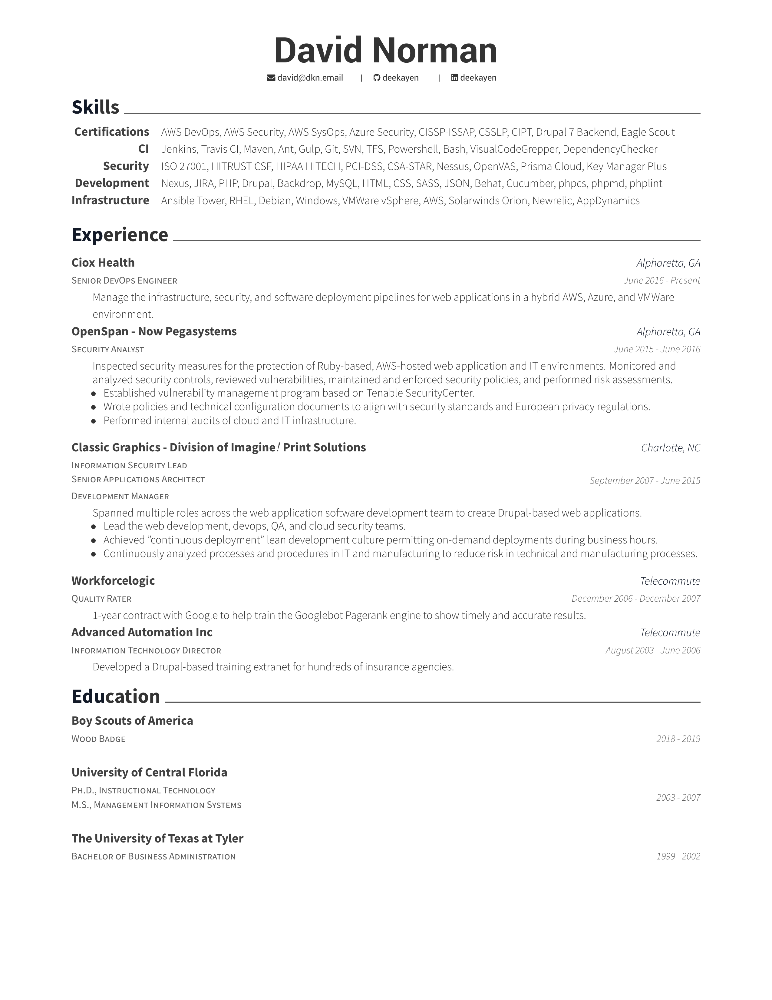

# Resume

## Setup

You need to download the full `texlive` and `texlive-xetex` packages.

Once the full `texlive` suite is available, run:
```
$ xelatex resume_cv.tex
```
And the pdf will be save as `resume.pdf` after spewing a bunch of warnings.

### Create PNG snapshot

```
pdftoppm -rx 300 -ry 300 -png resume_cv.pdf resume
```

### MacOS

http://www.texts.io/support/0001/

## Example


